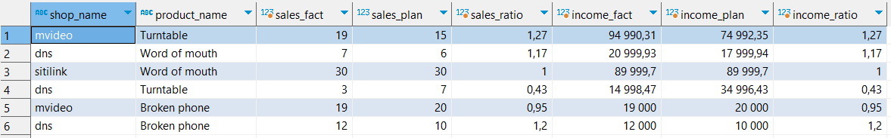
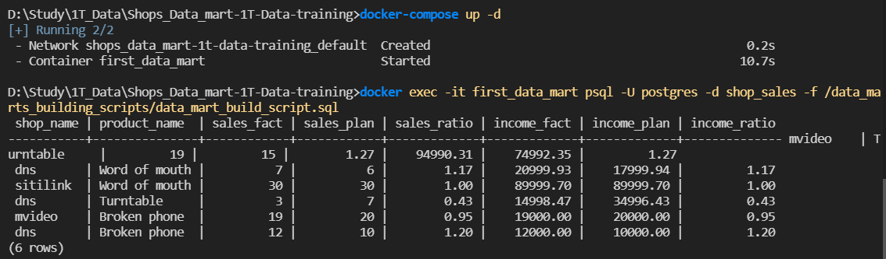

# Shops_Data_mart-1T-Data-training

## Первое задание
В качестве первого задания необходимо было доработать исходную схему данных\


По итогу, в схему была добавлена таблица shops, содержащая в себе id магазина, а также его имя.
Также было внесено изменение в таблицу plan — вместо shop_name теперь используется shop_id, что связывает таблицы shops и plan\


## Второе задание
Был подготовлен DDL [скрипт](init_script.sql) для создания таблиц и заполнения их данными

Затем был написан [скрипт](data_mart_build_script.sql) для сборки витрины данных, включающей в себя:
- shop_name — название магазина,
- product_name — название товара,
- sales_fact — количество фактических продаж на конец месяца,
- sales_plan — количество запланированных продаж на конец месяца,
- sales_ratio — отношение количества фактических продаж sales_fact к запланированному sales_plan,
- income_fact — фактический доход,
- income_plan — планируемый доход,
- income_ratio — отношение фактического дохода income_fact к запланированному income_plan.

Также в строках 2 и 21 можно выставить даты начала и конца месяца, за которые нужно получить витрину

Итоговый результат можно увидеть ниже:\


## Запуск в контейнере
Для запуска базы данных в контейнере подготовлен [docker-compose.yml](docker-compose.yml).\
Сделаны два тома: для init_script и для скрипта создания витрины. Init_script запускается сразу после создания контейнера, а data_mart_build_script вручную. Сделано это потому, что в случае добавления этих двух скриптов в директорию контейнера /docker-entrypoint-initdb.d оба скрипта не отрабатывают корректно (даже если добавить в начало init_script цифру 1, а в data_mart_build_script цифру 2, то отработает только первый скрипт, а второй не отобразится в логах). Также была проблема, если добавить в docker-compose строку entrypoint - это также не работало.\
Другой вариант, как сделать выполнение скрипта data_mart_build_script - это сделать отдельное приложение на python, которое будет выполнять скрипт после запуска базы данных. Как это работает, можно посмотреть [здесь](https://github.com/AinKub/Docker-1T-Data-training).

В итоге, чтобы запустить контейнер и сформировать витрину, необходимо выполнить две команды:
```
docker-compose up -d
docker exec -it first_data_mart psql -U postgres -d shop_sales -f /data_marts_building_scripts/data_mart_build_script.sql
```
Результат можно увидеть ниже:\


## Примечания
Также в скрипт можно добавить сортировку по магазинам, продуктам и т.д., добавив в конец скрипта `ORDER BY`.\
Также `sales_ratio` и `income_ratio` можно представить в виде процентов, домножив их на 100