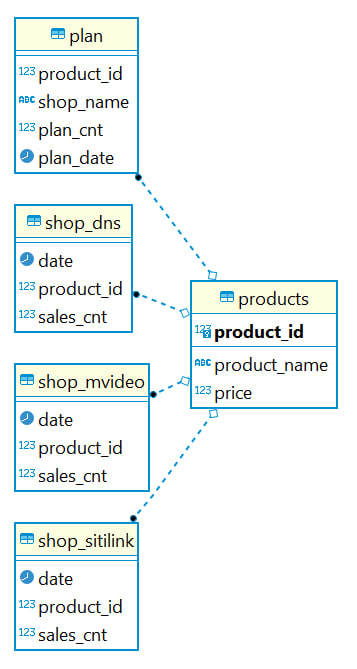
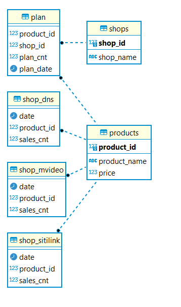

# Shops_Data_mart-1T-Data-training

В качестве первого задания необходимо было доработать исходную схему данных\

По итогу, в схему была добавлена таблица shops, содержащая в себе id магазина, а также его имя.
Также было внесено изменение в таблицу plan - вместо shop_name теперь используется shop_id, что связывает таблицы shops и plan\
